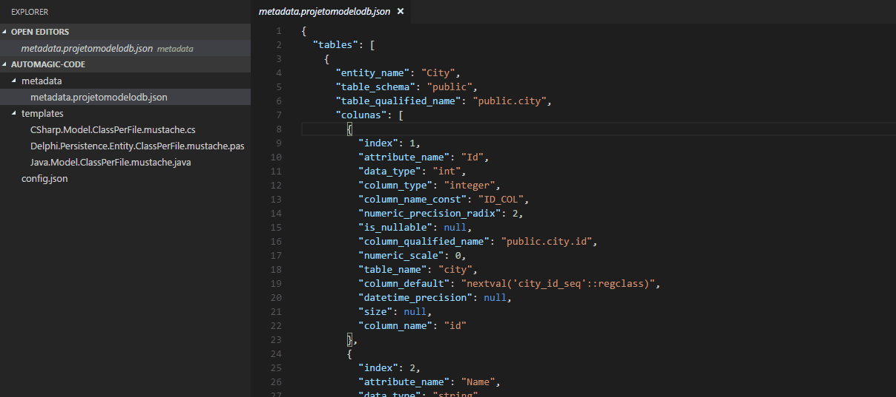

# Automagic code for Visual Studio Code

[](https://marketplace.visualstudio.com/items?itemName=jairzjunior.automagic-code)
[](https://marketplace.visualstudio.com/items?itemName=jairzjunior.automagic-code)

Automagic Code is a plugin for Visual Studio Code to make life easier to use [Mustache Logic-less Templates](http://mustache.github.io/).

Create your template and generate class for the program language and design pattern that best meets your needs.



## Generate Code

* Create file `config.json` with code
```json
{    
    "metadataJsonFile": ["json-metadata-file"],
    "templates":
    [
        {
            "name" : ["template-name"],
            "mustacheFile": ["template-mustache-file"],
            "outDir": ["output-derectory"]
        }
    ]    
}
```

* `json-metadata-file`: File path contain a JSON metadata
* `template-name`: Name of template
* `template-mustache-file`: File with a template Mustache
    * To generate a file separated using `---<EOF: {"nameFile": "{{file_name}}"}>---` in your template, where `file_name` should is present in `json-metadata-file` 

* `output-derectory`: Output directory for generated file

Press `F1` in VSCode and look for `Automagic Code: Generate`.

# License

[MIT](LICENSE.md) &copy; Jair Zeferino Júnior
